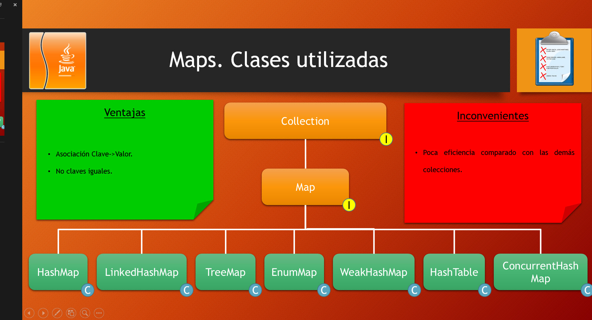

# MAP 

- Podemos dejar la clave vacía
- Viene identificado de la siguiente manera
    `Map<K,V>`

|clave | valor |
|:-----|------ |
|1     |valor1 |     
|2     |valor2 |     
|3     |valor3 |     

- Para asociar un elemento a su clave usamos el método `put(k,v)`
- Para obtener un valor para una clave determinada usamos el método `V get(Object key)`
- La interfaz Map tiene una interfaz interna:  `Set <Map.Entry<K,V> entrySet()`

